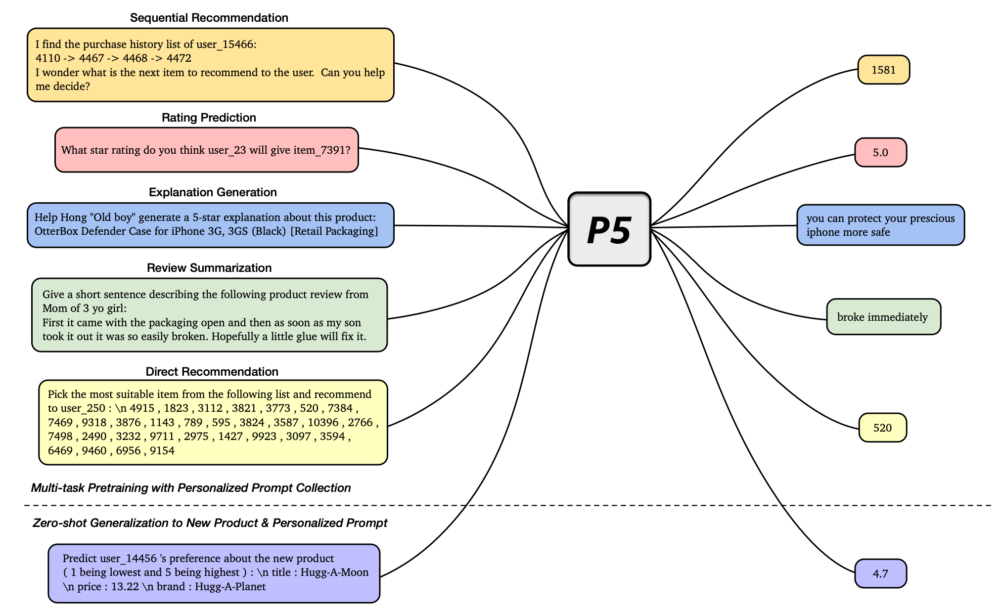

# Recommendation as Language Processing (RLP): A Unified Pretrain, Personalized Prompt & Predict Paradigm (P5)

> Paper link: https://arxiv.org/pdf/2203.13366.pdf



## Introduction
We present a flexible and unified Big Foundation Model for recommendation, which is the "Pretrain, Personalized Prompt, and Predict Paradigm" (**P5**) for recommendation. It unifies various recommendation tasks in a shared framework. In P5, all data such as user-item interactions, item metadata, and user reviews are converted to a common format -- natural language sequences. Specifically, P5 learns different tasks with the same language modeling objective during pretraining. Thus, it serves as the foundation model for downstream recommendation tasks, allows easy integration with other modalities, and enables instruction-based recommendation based on prompts. P5 advances recommender systems from shallow model to deep model to big model, and will revolutionize the technical form of recommender systems towards universal recommendation engine. With adaptive personalized prompt for different users, P5 is able to make predictions in a zero-shot or few-shot manner and largely reduces the necessity for extensive fine-tuning. On several recommendation benchmarks, we conduct experiments to show the effectiveness of P5. To help advance future research on Recommendation as Language Processing (RLP), Personalized Foundation Models (PFM), and Universal Recommendation Engine (URE), the source code, dataset, prompts, and pretrained P5 models are relased at this repository.

## Requirements:
- Python 3.9.7
- PyTorch 1.10.1
- transformers 4.2.1
- tqdm
- numpy
- sentencepiece
- pyyaml


## Usage

0. Clone this repo

    ```
    git clone https://github.com/jeykigung/P5.git
    ```

1. Download preprocessed data from this [Google Drive link](https://drive.google.com/file/d/1qGxgmx7G_WB7JE4Cn_bEcZ_o_NAJLE3G/view?usp=sharing), then put them into the *data* folder. If you would like to preprocess your own data, please follow the jupyter notebooks in the *preprocess* folder. Raw data can be downloaded from this [Google Drive link](https://drive.google.com/file/d/1uE-_wpGmIiRLxaIy8wItMspOf5xRNF2O/view?usp=sharing), then put them into the *raw_data* folder.

   
2. Download pretrained checkpoints into *snap* folder. If you would like to train your own P5 models, *snap* folder will also be used to store P5 checkpoints.


3. Pretrain with scripts in *scripts* folder, such as

    ```
    bash scripts/pretrain_P5_base_beauty.sh 4
    ```
    
    Here *4* means using 4 GPUs to conduct parallel pretraining.
    
4. Evaluate with example jupyter notebooks in the *notebooks* folder. Before testing, create a soft link of *data* folder to the *notebooks* folder by
   
   ```
   cd notebooks
   ln -s ../data .
   ```


## Pretrained Checkpoints
See [CHECKPOINTS.md](snap/CHECKPOINTS.md).


## Citation

Please cite the following paper corresponding to the repository:
```
@inproceedings{geng2022recommendation,
  title={Recommendation as Language Processing (RLP): A Unified Pretrain, Personalized Prompt \& Predict Paradigm (P5)},
  author={Geng, Shijie and Liu, Shuchang and Fu, Zuohui and Ge, Yingqiang and Zhang, Yongfeng},
  booktitle={Proceedings of the Sixteenth ACM Conference on Recommender Systems},
  year={2022}
}
```

## Acknowledgements

[VL-T5](https://github.com/j-min/VL-T5), [PETER](https://github.com/lileipisces/PETER), and [S3-Rec](https://github.com/aHuiWang/CIKM2020-S3Rec)
